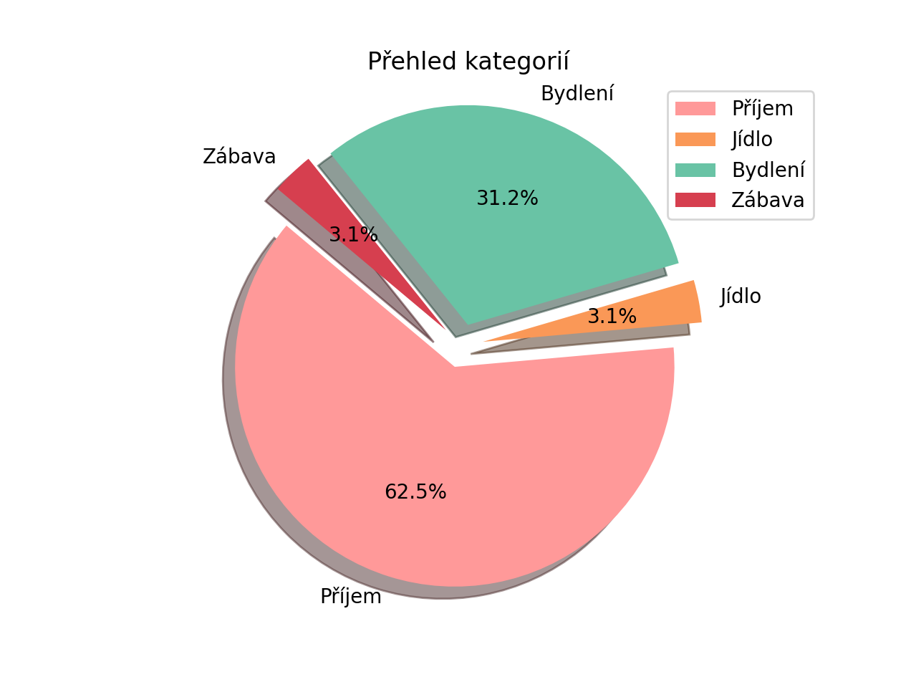

# Finanční Program

Tento program slouží k správě osobních financí. Umožňuje sledovat příjmy a výdaje, zobrazovat zůstatky, generovat reporty a vytvářet grafy.

## Potřebné rozšíření:
1. matplotlib - pip install matplotlib
2. datetime - není potřeba instalovat
3. random - není potřeba instalovat
4. json - není potřeba instalovat
5. os - není potřeba instalovat
6. plotly - pip install plotly
7. pandas - pip install pandas

## Spuštění:

Spusťte hlavní skript a je to.

## Funkce

- **Přidání příjmu**: Umožňuje zadat a uložit částku příjmu.
- **Přidání výdaje**: Umožňuje zadat a uložit částku výdaje spolu s kategorií.
- **Zobrazení aktuálního zůstatku**: Zobrazí aktuální zůstatek na účtu.
- **Zobrazení kategorií příjmů a výdajů**: Zobrazí všechny kategorie příjmů a výdajů spolu s příslušnými částkami.
- **Zobrazení grafu kategorií**: Vytvoří a zobrazí graf příjmů a výdajů dle kategorií.
- **Zobrazení interaktivního grafu kategorií**: Vytvoří a zobrazí interaktivní graf pomocí Plotly.
- **Generování měsíčního reportu**: Vytvoří měsíční přehled příjmů a výdajů.
- **Uložení dat**: Uloží aktuální data do souboru.
- **Načtení dat**: Načte data ze souboru, pokud existují.
- **Plánovač rozpočtu na příští měsíc**: Umožňuje plánovat příjem a výdaje na nadcházející měsíc.
- **Resetování dat**: Odstraní uložená data a resetuje program.

## Uživatelské rozhraní:

Vítejte v programu pro správu financí!

Co chcete udělat?
1. Přidat příjem
2. Přidat výdaj
3. Zobrazit aktuální zůstatek
4. Zobrazit kategorie příjmů a výdajů
5. Zobrazit graf kategorií
6. Zobrazit interaktivní graf kategorií
7. Měsíční report
8. Uložit data
9. Plánovač rozpočtu na příští měsíc
10. Resetovat data
11. Konec
Zadejte číslo možnosti:

### Příklad přidání příjmu

Zadejte číslo možnosti: 1
Zadejte částku příjmu: 5000

----------------------------------------
Příjem ve výši 5000 Kč byl úspěšně přidán.
Nový zůstatek je 5000 Kč.

----------------------------------------

### Přidání výdaje

Zadejte číslo možnosti: 2
Zadejte částku výdaje: 1500
Zadejte kategorii výdaje: Jídlo

----------------------------------------
Výdaj ve výši 1500 Kč byl přidán do kategorie 'Jídlo'.
Nový zůstatek je 3500 Kč.

----------------------------------------

### Zobrazení zůstatku

Zadejte číslo možnosti: 3

----------------------------------------
Aktuální zůstatek na účtu je 3500 Kč.

----------------------------------------

## Zobrazení kategorií

Zadejte číslo možnosti: 4
Kategorie příjmů a výdajů:

----------------------------------------
prijem: 5000 Kč
Jídlo: -1500 Kč

----------------------------------------

## Graf kategorií

## Měsíční report

Zadejte číslo možnosti: 7
Měsíční report za May 2024:

------------------------------
Celkové příjmy: 5000 Kč
Celkové výdaje: 1500 Kč
Detailní přehled výdajů:
- Jídlo: 1500 Kč

------------------------------

## Uložení a Načtení Dat
Data se automaticky ukládají do souboru "financni_data.json". Při spuštění programu se tato data načítají, pokud soubor existuje.

## Resetování dat

Zadejte číslo možnosti: 10
Data byla úspěšně resetována.

## Plánovač rozpočtu

Zadejte číslo možnosti: 9
Plánovač rozpočtu na příští měsíc.
Zadejte plánovaný příjem na příští měsíc: 6000
Zadejte kategorii výdaje (nebo 'konec' pro ukončení): Bydlení
Zadejte částku pro kategorii 'Bydlení': 2000
Zadejte kategorii výdaje (nebo 'konec' pro ukončení): konec

## Plánovaný rozpočet:

------------------------------

Plánovaný příjem: 6000 Kč
Bydlení: 2000 Kč
Počáteční zůstatek: 3500 Kč
Předpokládaný zůstatek na konci měsíce: 7500 Kč

------------------------------

## Budoucí možné vylepšení

1. Přidání grafického uživatelského rozhraní.
2. Integrace s bankovními API.

## Autor

Stanislav Hynek
